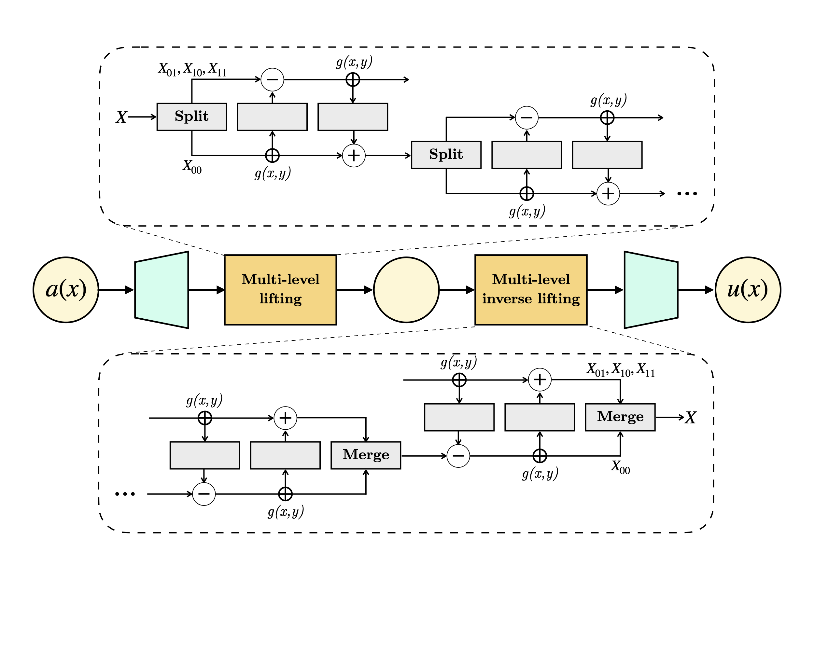
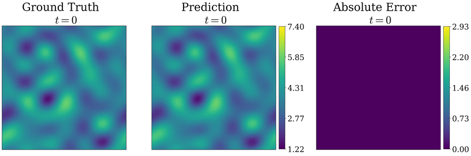

# LiNO: Lifting-based Multiresolution Neural Operator

[](https://arxiv.org/abs/2607.02715)
[](LICENSE)

LiNO, a lifting-based neural operator framework that integrates the second-generation wavelet into neural operator learning, providing a fully invertible and learnable multiresolution decomposition tailored to PDE training data. It offers a scale-aware operator evolution mechanism in the lifted multiresolution space that separately propagates coarse and directional detail coefficients while preserving localized physical interactions.


---

<p align="center">
  
</p>

*Schematic of the proposed lifting-based neural operator*

#### LiNO prediction on Navier-Stokes and Gray-Scott reaction-diffusion system
<p align="center">
  
</p>

<p align="center">
  
</p>


Requires Python ≥3.10 and a CUDA-capable GPU (paper results were produced on an NVIDIA RTX 4500,
32 GB, CUDA 12.3).

## Quickstart
Each benchmark has a dedicated config.json, train.log and trained_model.pth along with python scripts for training and evaluation. To quickly reproduce the results, follow the steps below:

```python
#import python script
from lino_darcy import*

# update the path to the saved model and data file
checkpoint = torch.load(best_ckpt_path)

params = checkpoint['model_state']
train_loss = checkpoint['loss']

model.load_state_dict(params)

# model evaluation and visualization over 3 randomly sampled test inputs
model_eval(epoch=epochs, loss=train_loss, t0=time.time(), inference=True)
visualization()
```


## Datasets

All datasets used in this study have been compiled into a single archive, available here:

📁 **[Google Drive — LiNO benchmark datasets](<GDRIVE_LINK_HERE>)**

If you'd rather regenerate data from the original sources instead:

- **Darcy flow / Allen–Cahn**: available from the [FNO](https://github.com/neuraloperator/neuraloperator) and [WNO](https://github.com/TapasTripura/WNO)
- **Compressible Navier–Stokes**: requires the [PDEBench](https://github.com/pdebench/PDEBench) download utility - see its [dataset](https://darus.uni-stuttgart.de/dataset.xhtml?persistentId=doi:10.18419/darus-2986)
- **Gray–Scott**: requires the `the-well` package (`pip install the-well`), then `python -m the_well.download --dataset gray_scott_reaction_diffusion` - more about [dataset](https://polymathic-ai.org/the_well/)


## Citation

If you use LiNO in your research, please cite:

```bibtex
@article{pandey2026lino,
  title   = {LiNO: Lifting based multiresolution neural operator},
  author  = {Pandey, Himanshu and Patel, Subham and Behera, Ratikanta},
  journal = {arXiv preprint arXiv:2607.02715},
  year    = {2026}
}
```


## License

This project is released under the [MIT License](LICENSE).

## Acknowledgments

Subham Patel acknowledges the Axis Bank Centre for Mathematics and Computing, Indian Institute
of Science, Bangalore, for financial support carried out at the IISc Mathematics Initiative,
Department of Mathematics.
